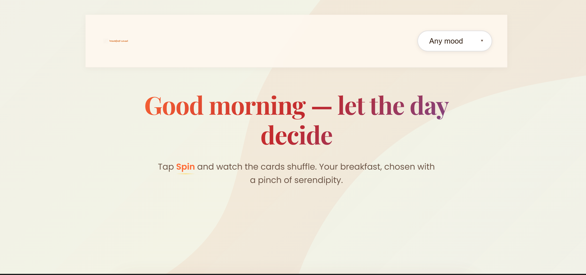
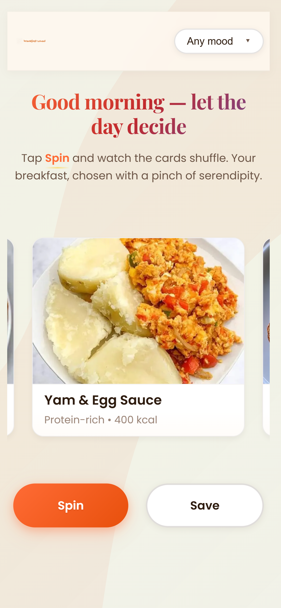
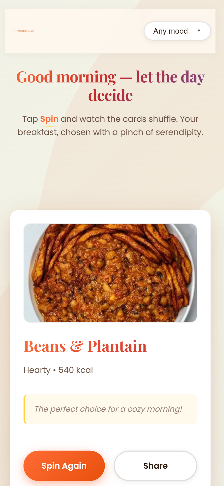

# 🥞 Breakfast Wheel

> A delightful, interactive web app that helps you decide what to have for breakfast! Spin the wheel and let fate (and your mood) choose your morning meal.



## ✨ Features

- 🎡 **Interactive Spin Animation** - Watch the cards shuffle and randomly select your breakfast
- 🎭 **Mood-Based Filtering** - Filter breakfast options by your current mood (Comfort, Healthy, Rushed, Relaxed)
- 🎨 **Beautiful UI** - Modern design with gradient text, smooth animations, and appetizing visuals
- 📱 **Fully Responsive** - Works seamlessly on mobile, tablet, and desktop
- 📋 **Copy to Clipboard** - Share your breakfast choice with friends
- ♿ **Accessible** - Built with screen reader support and semantic HTML

## 🚀 Live Demo

[View Live Demo](https://mjay-code-oss.github.io/breakfast-wheel/) 

## 🛠️ Technologies Used

- **HTML5** - Semantic markup
- **CSS3** - Custom properties, Flexbox, animations
- **Vanilla JavaScript** - No frameworks, just pure JS
- **Google Fonts** - Playfair Display & Poppins

## 📂 Project Structure
```
breakfast-wheel/
├── index.html          # Main HTML structure
├── styles.css          # All styling and responsive design
├── script.js           # JavaScript functionality
├── assets/
│   ├── images/         # Food images and logo
└── README.md           # This file!
```

## 🎯 How It Works

1. **Select Your Mood** - Choose from "Any mood", "Comfort", "Healthy", "Rushed", or "Relaxed"
2. **Click Spin** - The wheel animates and randomly selects a breakfast
3. **See Your Result** - View your chosen breakfast with a fun quote
4. **Spin Again** - Try again for a different option!

## 🧠 What I Learned

Building this project helped me strengthen my skills in:
- ✅ DOM manipulation with JavaScript
- ✅ Event listeners and handling user interactions
- ✅ Creating smooth CSS animations and transitions
- ✅ Using `Math.random()` for randomization
- ✅ Mobile-first responsive design
- ✅ Accessibility best practices
- ✅ Working with the Clipboard API
- ✅ Managing state in vanilla JavaScript

## 💡 Future Improvements

- [ ] Add recipe details for each breakfast option
- [ ] Integrate with a recipe API (Spoonacular or TheMealDB)
- [ ] Save favorite breakfasts
- [ ] Add more breakfast options
- [ ] Include nutritional information
- [ ] Add sound effects for the spin (optional)
- [ ] Create user accounts for saving preferences
- [ ] Add dark mode toggle

## 🚀 How to Run Locally

1. Clone this repository:
```bash
   git clone https://github.com/YOUR-USERNAME/breakfast-wheel.git
```

2. Navigate to the project folder:
```bash
   cd breakfast-wheel
```

3. Open `index.html` in your browser:
   - **Windows:** Double-click the file
   - **Mac:** Right-click → Open with → Browser
   - **Or use Live Server** in VS Code

That's it! No build process, no dependencies! 🎉

## 🤝 Contributing

Found a bug or have a suggestion? Feel free to:
1. Fork this repository
2. Create a new branch (`git checkout -b feature/amazing-feature`)
3. Commit your changes (`git commit -m 'Add some amazing feature'`)
4. Push to the branch (`git push origin feature/amazing-feature`)
5. Open a Pull Request

## 📸 Screenshots

### Desktop View


### Mobile View


### Spin Animation


## 📝 License

This project is open source and available under the [MIT License](LICENSE).

## 👩‍💻 About Me

Hi! I'm **MaryJane Ibemere**, a developer from Lagos, Nigeria, passionate about building beautiful, functional web applications. This is one of my learning projects as I continue growing my skills in web development.

**Connect with me:**
- 🌐 Portfolio: [Coming Soon]
- 📧 Email: maryjaneibemere@gmail.com

---

⭐ If you like this project, please give it a star on GitHub!

Made with ❤️ and ☕ in Lagos, Nigeria